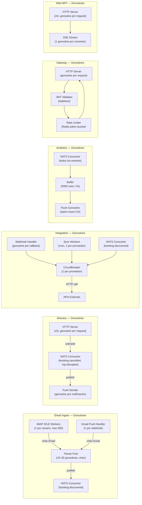

```mermaid
    graph LR
    subgraph "Email Ingest — Goroutines"
        IMAP_W["IMAP IDLE Workers<br/>(1 por usuario, max 500)"]
        GMAIL_W["Gmail Push Handler<br/>(1 por webhook)"]
        PARSE_POOL["Parser Pool<br/>(10–50 goroutines, chan)"]
        EI_KAFKA_C["NATS Consumer<br/>(booking.discovered)"]
        IMAP_W -->|"chan Email"| PARSE_POOL
        GMAIL_W -->|"chan Email"| PARSE_POOL
        PARSE_POOL -->|"publish"| EI_KAFKA_C
    end

    subgraph "Itinerary — Goroutines"
        IT_HTTP["HTTP Server<br/>(chi, goroutine por request)"]
        IT_KAFKA_C["NATS Consumer<br/>(booking.cancelled, trip.disrupted)"]
        IT_PUSH["Push Sender<br/>(goroutine por notificación)"]
        IT_HTTP -->|"usecase"| IT_KAFKA_C
        IT_KAFKA_C -->|"publish"| IT_PUSH
    end

    subgraph "Integration — Goroutines"
        INT_WEBHOOK["Webhook Handler<br/>(goroutine por callback)"]
        INT_SYNC["Sync Workers<br/>(cron, 1 por proveedor)"]
        INT_KAFKA_C["NATS Consumer<br/>(booking.discovered)"]
        CB["CircuitBreaker<br/>(1 por proveedor)"]
        INT_WEBHOOK --> CB
        INT_SYNC --> CB
        INT_KAFKA_C --> CB
        CB -->|"HTTP call"| EXT["APIs Externas"]
    end

    subgraph "Analytics — Goroutines"
        AN_KAFKA_C["NATS Consumer<br/>(todos los eventos)"]
        AN_BUF["Buffer<br/>(5000 rows / 5s)"]
        AN_FLUSH["Flush Goroutine<br/>(batch insert CH)"]
        AN_KAFKA_C --> AN_BUF --> AN_FLUSH
    end

    subgraph "Gateway — Goroutines"
        GW_HTTP["HTTP Server<br/>(goroutine por request)"]
        GW_RATE["Rate Limiter<br/>(Redis token bucket)"]
        GW_AUTH["JWT Validator<br/>(stateless)"]
        GW_HTTP --> GW_AUTH --> GW_RATE --> GW_HTTP
    end

    subgraph "Web BFF — Goroutines"
        W_HTTP["HTTP Server<br/>(chi, goroutine por request)"]
        W_SSE["SSE Stream<br/>(1 goroutine por conexión)"]
        W_HTTP --> W_SSE
    end   
```
