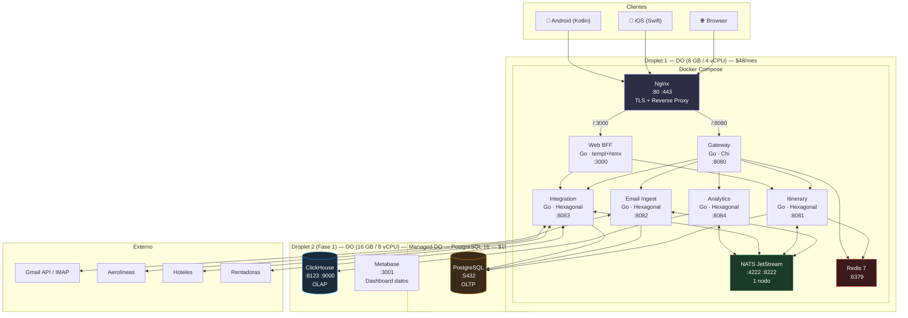

```mermaid
  graph TB
    subgraph "Droplet 1 — DO (8 GB / 4 vCPU) — $48/mes"
        subgraph "Docker Compose"
            NGINX["Nginx<br/>:80 :443<br/>TLS + Reverse Proxy"]
            GW["Gateway<br/>Go · Chi<br/>:8080"]
            WEB["Web BFF<br/>Go · templ+htmx<br/>:3000"]
            ITIN["Itinerary<br/>Go · Hexagonal<br/>:8081"]
            EING["Email Ingest<br/>Go · Hexagonal<br/>:8082"]
            INT["Integration<br/>Go · Hexagonal<br/>:8083"]
            ANA["Analytics<br/>Go · Hexagonal<br/>:8084"]
            NATS["NATS JetStream<br/>:4222 :8222<br/>1 nodo"]
            REDIS["Redis 7<br/>:6379"]
        end
    end

    subgraph "Managed DO — PostgreSQL 16 — $15-30/mes"
        PG[("PostgreSQL<br/>:5432<br/>OLTP")]
    end

    subgraph "Droplet 2 (Fase 1) — DO (16 GB / 8 vCPU) — $96/mes"
        CH[("ClickHouse<br/>:8123 :9000<br/>OLAP")]
        METABASE["Metabase<br/>:3001<br/>Dashboard datos"]
    end

    subgraph "Externo"
        MAIL["Gmail API / IMAP"]
        AIR["Aerolíneas"]
        HOTEL["Hoteles"]
        CAR["Rentadoras"]
    end

    subgraph "Clientes"
        BROWSER["🌐 Browser"]
        IOS["📱 iOS (Swift)"]
        AND["📱 Android (Kotlin)"]
    end

    BROWSER --> NGINX
    IOS --> NGINX
    AND --> NGINX

    NGINX -->|"/:8080"| GW
    NGINX -->|"/:3000"| WEB

    GW --> ITIN
    GW --> EING
    GW --> INT
    GW --> ANA

    WEB --> ITIN
    WEB --> INT

    ITIN --> PG
    EING --> PG
    INT --> PG
    ITIN --> REDIS
    GW --> REDIS

    EING <--> NATS
    ITIN <--> NATS
    INT <--> NATS
    ANA <--> NATS

    ANA --> CH

    EING <--> MAIL
    INT <--> AIR
    INT <--> HOTEL
    INT <--> CAR

    style NGINX fill:#2d2d44,stroke:#7c6ff7,color:#fff
    style NATS fill:#1a3a2a,stroke:#4caf50,color:#fff
    style PG fill:#3a2a1a,stroke:#ff9800,color:#fff
    style REDIS fill:#3a1a1a,stroke:#f44336,color:#fff
    style CH fill:#1a2a3a,stroke:#2196f3,color:#fff   
```
