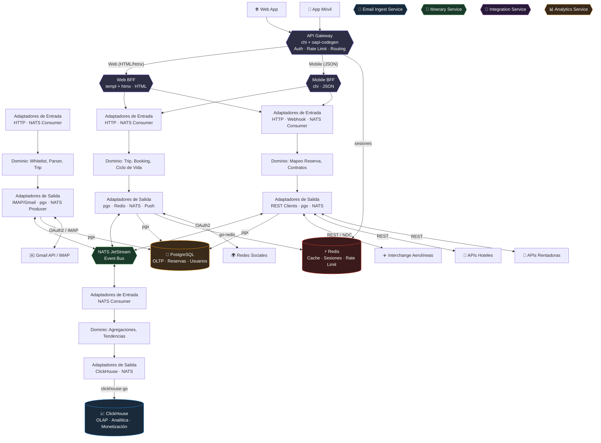

```mermaid
    graph TB
    %% CLIENTES
    WEB["🌐 Web App"]
    MOBILE["📱 App Móvil"]

    %% EDGE
    GW{{"API Gateway<br/>chi + oapi-codegen<br/>Auth · Rate Limit · Routing"}}

    %% BFF (uno por experiencia, tras el Gateway — ADR-013)
    WEBBFF{{"Web BFF<br/>templ + htmx · HTML"}}
    MOBBFF{{"Mobile BFF<br/>chi · JSON"}}

    %% BROKER
    NATS{{"NATS JetStream<br/>Event Bus"}}

    %% MICROSERVICIOS (hexágonos)
    ING{{"📧 Email Ingest Service"}}
    ITIN{{"🧳 Itinerary Service"}}
    INT{{"🔗 Integration Service"}}
    ANA{{"📊 Analytics Service"}}

    %% CAPAS INTERNAS (adaptadores)
    ING_IN["Adaptadores de Entrada<br/>HTTP · NATS Consumer"]
    ING_DOM["Dominio: Whitelist, Parser, Trip"]
    ING_OUT["Adaptadores de Salida<br/>IMAP/Gmail · pgx · NATS Producer"]

    ITIN_IN["Adaptadores de Entrada<br/>HTTP · NATS Consumer"]
    ITIN_DOM["Dominio: Trip, Booking, Ciclo de Vida"]
    ITIN_OUT["Adaptadores de Salida<br/>pgx · Redis · NATS · Push"]

    INT_IN["Adaptadores de Entrada<br/>HTTP · Webhook · NATS Consumer"]
    INT_DOM["Dominio: Mapeo Reserva, Contratos"]
    INT_OUT["Adaptadores de Salida<br/>REST Clients · pgx · NATS"]

    ANA_IN["Adaptadores de Entrada<br/>NATS Consumer"]
    ANA_DOM["Dominio: Agregaciones, Tendencias"]
    ANA_OUT["Adaptadores de Salida<br/>ClickHouse · NATS"]

    %% BASES DE DATOS
    PG[("🐘 PostgreSQL<br/>OLTP · Reservas · Usuarios")]
    REDIS[("⚡ Redis<br/>Cache · Sesiones · Rate Limit")]
    CLICK[("📈 ClickHouse<br/>OLAP · Analítica · Monetización")]

    %% APIs EXTERNAS
    MAIL["✉️ Gmail API / IMAP"]
    AIR["✈️ Interchange Aerolíneas"]
    HOTEL["🏨 APIs Hoteles"]
    CAR["🚗 APIs Rentadoras"]
    SOC["🌍 Redes Sociales"]

    %% CONEXIONES CLIENTE → GATEWAY (single entry — ADR-013)
    WEB --> GW
    MOBILE --> GW

    %% GATEWAY → BFF (uno por experiencia)
    GW -->|"Web (HTML/htmx)"| WEBBFF
    GW -->|"Mobile (JSON)"| MOBBFF

    %% BFF → SERVICIOS DE DOMINIO
    WEBBFF --> ITIN_IN
    WEBBFF --> INT_IN
    MOBBFF --> ITIN_IN
    MOBBFF --> INT_IN

    %% INTERNOS (entrada → dominio → salida)
    ING_IN --> ING_DOM --> ING_OUT
    ITIN_IN --> ITIN_DOM --> ITIN_OUT
    INT_IN --> INT_DOM --> INT_OUT
    ANA_IN --> ANA_DOM --> ANA_OUT

    %% SERVICIOS → BROKER
    ING_OUT <--> NATS
    ITIN_OUT <--> NATS
    INT_OUT <--> NATS
    NATS <--> ANA_IN

    %% SERVICIOS → BASES DE DATOS
    ING_OUT -->|"pgx"| PG
    ITIN_OUT -->|"pgx"| PG
    ITIN_OUT -->|"go-redis"| REDIS
    INT_OUT -->|"pgx"| PG
    ANA_OUT -->|"clickhouse-go"| CLICK

    %% SERVICIOS → EXTERNOS
    ING_OUT <-->|"OAuth2 / IMAP"| MAIL
    INT_OUT <-->|"REST / NDC"| AIR
    INT_OUT <-->|"REST"| HOTEL
    INT_OUT <-->|"REST"| CAR
    ITIN_OUT <-->|"OAuth2"| SOC

    %% GATEWAY → CACHE
    GW -->|"sesiones"| REDIS

    %% ESTILOS
    style GW fill:#2d2d44,stroke:#7c6ff7,color:#fff
    style WEBBFF fill:#2d2d44,stroke:#7c6ff7,color:#fff
    style MOBBFF fill:#2d2d44,stroke:#7c6ff7,color:#fff
    style NATS fill:#1a3a2a,stroke:#4caf50,color:#fff
    style PG fill:#3a2a1a,stroke:#ff9800,color:#fff
    style REDIS fill:#3a1a1a,stroke:#f44336,color:#fff
    style CLICK fill:#1a2a3a,stroke:#2196f3,color:#fff
    style ING fill:#1a2a3a,stroke:#64b5f6,color:#fff
    style ITIN fill:#1a3a2a,stroke:#81c784,color:#fff
    style INT fill:#2a1a3a,stroke:#ba68c8,color:#fff
    style ANA fill:#3a2a1a,stroke:#ffb74d,color:#fff
```
