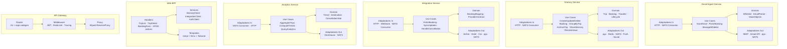

```mermaid
graph TB
    subgraph "Email Ingest Service"
        EI_D["Domain<br/>Whitelist · EmailParser · ValueObjects"]
        EI_UC["Use Cases<br/>ScanEmail · ParseBooking · ManageWhitelist"]
        EI_IN["Adaptadores In<br/>HTTP · NATS Consumer"]
        EI_OUT["Adaptadores Out<br/>IMAP · Gmail API · pgx · NATS"]
        EI_IN --> EI_UC --> EI_D
        EI_UC --> EI_OUT
    end

    subgraph "Itinerary Service"
        IT_D["Domain<br/>Trip · Booking · Traveler · Lifecycle"]
        IT_UC["Use Cases<br/>Create/Update/Delete Booking · GroupByTrip<br/>ArchiveTrip · ShareItinerary · ResolveIssue"]
        IT_IN["Adaptadores In<br/>HTTP · NATS Consumer"]
        IT_OUT["Adaptadores Out<br/>pgx · Redis · NATS · Push · Social"]
        IT_IN --> IT_UC --> IT_D
        IT_UC --> IT_OUT
    end

    subgraph "Integration Service"
        IN_D["Domain<br/>BookingMapping · ProviderContract"]
        IN_UC["Use Cases<br/>FetchBooking · SyncUpdates · HandleCancellation"]
        IN_IN["Adaptadores In<br/>HTTP · Webhook · NATS Consumer"]
        IN_OUT["Adaptadores Out<br/>Airline · Hotel · Car · pgx · NATS"]
        IN_IN --> IN_UC --> IN_D
        IN_UC --> IN_OUT
    end

    subgraph "Analytics Service"
        AN_D["Domain<br/>Trend · Destination · CancellationStat"]
        AN_UC["Use Cases<br/>AggregateTrips · ComputeTrends · QueryAnalytics"]
        AN_IN["Adaptadores In<br/>NATS Consumer · HTTP"]
        AN_OUT["Adaptadores Out<br/>ClickHouse · NATS"]
        AN_IN --> AN_UC --> AN_D
        AN_UC --> AN_OUT
    end

    subgraph "Web BFF"
        W_H["Handlers<br/>TripList · TripDetail · BookingForm · HTMX actions"]
        W_S["Services<br/>ItineraryClient · IntegrationClient · AuthClient"]
        W_T["Templates<br/>templ + htmx + Tailwind"]
        W_H --> W_S
        W_H --> W_T
    end

    subgraph "API Gateway"
        G_R["Router<br/>chi + oapi-codegen"]
        G_M["Middleware<br/>JWT · RateLimit · Tracing"]
        G_P["Proxy<br/>httputil.ReverseProxy"]
        G_R --> G_M --> G_P
    end   
```
